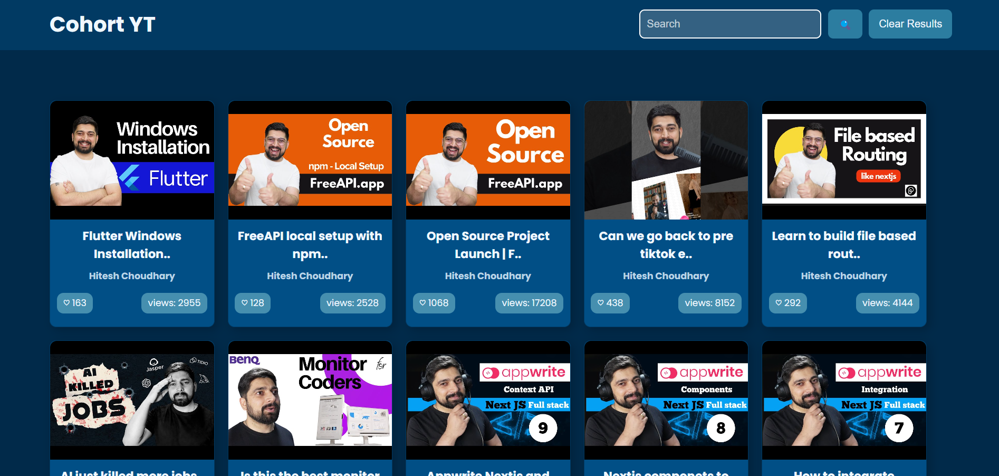
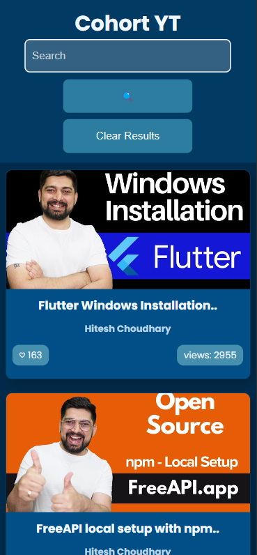

# Cohort YT - YouTube Video Fetcher

## 📌 Overview
Cohort YT is a web application that fetches and displays YouTube videos using an API. Users can search for videos, view thumbnails, and access YouTube links directly. The application is styled using modern UI techniques and is mobile-responsive.

## 🚀 Features
- Fetches YouTube videos dynamically using an API
- Displays video thumbnails, titles, and channel names
- Shows view count and like count for each video
- Provides a search functionality to filter videos
- Responsive design for mobile and desktop
- Clear results functionality to reset searches
- Smooth user experience with animations and transitions

## 📸 Screenshots

## 🛠️ Technologies Used
- **HTML** - Structure the webpage
- **CSS** - Styling with a modern and responsive layout
- **JavaScript** - Fetch API, DOM manipulation, and event handling

## 🌐 Deployment
This project is deployed and can be accessed here:
🔗 [Live Demo](https://your-deployment-link.com)

---

Happy Coding! 🚀